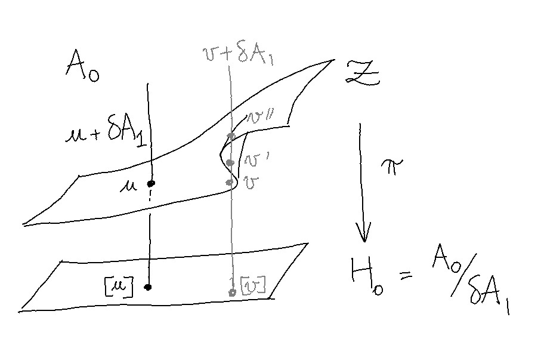

<!-- dom --> 
 

 

<!-- bp --> 
 
 
 

# Singularities with Two Loops

Consider the system
$\Omega = \\{ i_+, j_+, k, i_-, j_- \\}$
of five binary variables,
interacting along  
two triangular loops $i_+ j_+ k$ 
and $i_-j_-k$ meeting in $k$. 

    

 
    

         
    
 

The submanifold ${\cal Z} \subseteq A_0$ 
of consistent potentials, fixed by diffusion,
is not everywhere transverse to the image $\delta A_1 \subseteq A_0$ of heat fluxes. 
It may therefore happen that the homology class 
$[u] = u + \delta A_1$ of a potential $u \in A_0$ intersects the equilibrium
surface $\mathcal Z$ more than once.

The singular subspace ${\cal S_1} \subseteq {\cal Z}$, 
along which the intersection of $T {\cal Z}$ with $\delta A_1$ is of dimension $1$,
is here a codimension $1$ analytic submanifold of ${\cal Z}$.

## Cusp and Singularities

For every $u \in {\cal S_1}$, 
there exists a unit flux term $\delta \varphi \in \delta A_1$ 
spanning $T_u {\cal Z} \cap \delta A_1$. 

Singular equilibria are generically unstable, 
so that perturbing $u$ in the direction of $ \pm \delta \varphi$
may lead to another distant equilibrium $u' \in {\cal Z} \cap [u]$ 
under diffusion. Along a path in ${\cal S_1}$, 
it may furthermore happen that the two homologous equilibria $u \sim u'$ meet, 
in which case $u$ is called a _cusp_. 

In the plots below, such a path in ${\cal S_1}$ is observed: 
each trace corresponds to a different diffusion
starting from a perturbed initial condition 
$u_0 = u + \delta \varphi$, where 
$\delta \varphi$ spans $T_u {\cal Z} \cap \delta A_1$ 
and $u$ follows a smooth path 
leaving from the cusp. 

### Distance away from $u$

In the acyclic case, diffusion is ensured 
to converge to a single equilibrium within any 
given homology class $[u] = u + \delta A_1$. 
Hence ${\cal Z}$ is attractive and 
perturbing $u \in {\cal Z}$ by a flux term $\delta \varphi$ 
always leads back to $u$. 

By contrast, the plot below shows that equilibria within $[u]$ 
for $u \in {\cal S_1}$ are generically multiple:
as $u$ moves away from the cusp, 
the homologous equilibrium
$u' = \lim_{t \to \infty} u_t$ 
parts with $u$. 

 
<!--
 
-->
 

### Distance away from ${\cal Z}$ 

The stationary manifold ${\cal Z}$ is defined by the effective
consistency constraints ${\cal D}(U) = 0$, 
where $U = \zeta \cdot u$ denotes the 
local hamiltonians associated to a potential $u$. 
The norm of ${\cal D}(U)$ hence represents an amount 
of inconsistency and a distance away from ${\cal Z}$. 

In the acyclic case, this amount of inconsistency seems 
to always follow an exponential decay under diffusion.

By contrast, the plot below shows integral curves 
starting relatively close from the stationary manifold
that locally flow away from ${\cal Z}$, until they hit another stationary
layer folded across $\delta A_1$.  

 
<!--
 
-->
 

## The Singular Subspace

The singularity condition 
$\delta \varphi \in {\rm Ker}(\nabla_u \circ \zeta) = T_u {\cal Z}$ 
yields conservation equations of the form: 

$$ \begin{equation}\label{conservation} 
 \varphi_{jk \to k} = {\mathbb E^{jk}} \Big[
    \sum_{i \neq k} \varphi_{ij \to j} 
    \:\Big|\: k \Big] 
\end{equation} $$

for all edge-vertex pair $jk \to k$ in the degree-one nerve of $X$. 
Denoting by $M : A_1 \to A_1$ the operator 
$1 - (\nabla_u \circ \zeta \circ \delta)$, 
the above system of equations derives from 
$\varphi = M(\varphi)$, having non-trivial 
solutions if and only if $1$ is an eigenvalue of $M$. 

### Parameterising ${\cal Z}$ 

Denote by ${\mathbb E}^{jk \to k} = {\mathbb E}^{jk}[-|k]$ 
the conditional expectation operator, orthogonal 
projection of $A_j$ onto $A_k$ viewed as subspaces of 
$A_{jk}$, for the metric induced by local Gibbs states. 

Given orthonormal bases of $(1_j, v_j)$ and $(1_k, v_k)$ 
of $A_j$ and $A_k$, conditional expectations take 
a diagonal form: 

$$ 
{\mathbb E}^{jk \to k} : 
\left| \begin{array}{l} 
v_j \mapsto \lambda_{jk} \cdot v_k \\
1_j \mapsto 1_k 
\end{array} \right. 
$$ 

where the eigenelements  $\lambda_{jk}$ and $v_j$ are given by: 

$$ 
\lambda_{jk} = \frac 
{ p_{jk}^{++}p_{jk}^{--} - p_{jk}^{+-} p_{jk}^{-+} }
{ (p_j^+ p_j^- \cdot p_k^+ p_k^-)^{1/2}}
\qquad \mathrm{and} \qquad 
v_j =  \frac {p_j^- |+\rangle - p_j^+ |- \rangle } {(p_j^+ p_j^-)^{1/2}} 
$$ 

and $p_{jk}$ is the local Gibbs state, normalising the Gibbs density 
${\rm e}^{-U_{jk}} = {\rm e}^{-u_{jk} - u_j - u_k}$. 
The above remark stands for any pair of binary variables 
$(x_j, x_k) \in \\{ \pm 1 \\}^2$. 

Furthermore introducing 
local magnetic fields $b_j = - {1 \over 2} \ln(p_j^+ / p_j^-)$, 
by the real numbers $\\{ b_j , \lambda_{jk} \\}$
for _any graph of binary variables_,
with:

$$ \begin{equation} \label{positivity}
|b_j - b_k| \leq -\ln \lambda_{jk} 
\end{equation} $$ 

translating  positivity constraints
in the space of parameters, while $\lambda_{jk} \leq 1$ by construction.   

### Parameterising ${\cal S_1}$ 

One may show that ${\cal S_1}$ is defined
by a quadratic equation on loop eigenvalues: 

$$ \begin{equation} \label{hyperbola} 
\Big( \Lambda^+ + \frac 1 3 \Big)\Big( \Lambda^- + \frac 1 3 \Big) = \frac 4 9 
\end{equation} $$ 

where 
$\Lambda^{\pm} = \lambda_{k i^\pm} \, \lambda_{i^\pm j^\pm} \, \lambda_{j^\pm k}$ 
is the non-trivial eigenvalue of the loop operator ${\rm L}^\pm : A_k \to A_k$ 
obtained by composing conditional expectations: 

$$ 
{\rm L}^{\pm} = {\mathbb E}^{j^\pm k \to k} \circ
{\mathbb E}^{i^\pm j^\pm \to j^\pm} \circ 
{\mathbb E}^{ki^\pm \to i^\pm} 
$$

Deriving ($\ref{hyperbola}$) from 
the conservation equations ($\ref{conservation}$) 
is left as an exercise to the reader:
using the previous parameterisation of ${\cal Z}$, 
conditional expectations act as multiplications by scalars 
and lead to computations somewhat reminiscent of Kirchhoff's laws 
on electric circuits. 

A few more efforts are required to write $\varphi \mapsto M(\varphi)$ 
in diagonal form, to a parameterise a current $\varphi \in A_1$ 
singular as soon as equation $(\ref{hyperbola})$ holds. 

Note that only the largest eigenvalue of $M$ may reach $1$, 
so that the stratified space 
$${\cal S} = \bigcup_k {\cal S}_k$$
is indeed a codimension $$1$$
analytic submanifold of $${\cal Z}$$, with $${\cal S} = {\cal S}_{1}$$ and 
$${\cal S}_2 = {\cal S}_{3} = \dots = \varnothing$$. 

### Tuning parameters 

The controls below are mapped to points in ${\cal Z}$,
with fields $b_i$ in red and couplings $\lambda_{ij}$ in green.  

The yellow square $]-1, +1[^2$ describes possible values 
for the pair $(\Lambda^+, \Lambda^-)$, in which ${\cal S_1}$ 
projects to the hyperbola depicted in blue. 

The two green triangles then describe logarithmic couplings on each loop, 
which by definition of the loop eigenvalue $\Lambda^\pm$ should solve:

$$ 
-\ln |\lambda_{ij}^\pm| -\ln |\lambda_{jk}^\pm| - \ln |\lambda_{ki}^\pm| 
= - \ln \Lambda^\pm 
$$  

Note that we assume positivity of each $\lambda_{ij}$ : 
as $\Lambda \in ]0, 1[$ no coupling on the loop may vanish, while 
reverting the sign of two adjacent couplings $\lambda_{ij}$ and $\lambda_{jk}$ 
may be seen equivalent to exchanging the "up" and "down" states $|+\rangle$ and 
$|-\rangle$ on the $j$ vertex. 
Therefore ${\cal S_1}$ is not connected in ${\cal Z}$, 
with $({\mathbb Z}/2 {\mathbb Z})^5$ acting on its $8$
diffeomorphic connected components. 

The first red control describes the effect of an 
external magnetic field $B = b_k$. 
In absence of magnetic fields, 
the $|+ \rangle$ and $|-\rangle$ states are interchangeable on all vertices. 
With zero fields, it may moreover
 be seen that $\delta \varphi \in \delta A_1$ is also tangent 
to ${\cal S_1}$ : the singularity is cuspidal.

The two red polygons finally parameterise offsets between 
local fields $(b_{i^\pm}, b_{j^\pm})$ with respect to the external 
field $b_k = B$, positive probability constraints 
enforcing three kinds of inequalities of the form 
$(\ref{positivity})$ whose breadths 
depend on the couplings. 

    

 
    
 
        

 
        

 
    
 
    

 
    
 
        

        

    
 

 

N.B: <em>If some of the dots move too close to a boundary, 
NaNs that may be encountered are believed 
an artefact of some local probabilities tending to zero 
-- although a javascript or mathematical error is not to be banned. </em>  

 

The above plots are associated to diffusions originating 
from $u_0 = u \pm \delta \varphi$. 
One may see how the external magnetic field makes either one of the initial 
conditions unstable, as $u$ moves away from the cusp. 

<!-- ====== js ====== -->

<!-- figure --> 
 

<!-- controls --> 
 
 

 

<!-- app --> 
 

<!-- ====== style ====== --> 

 
