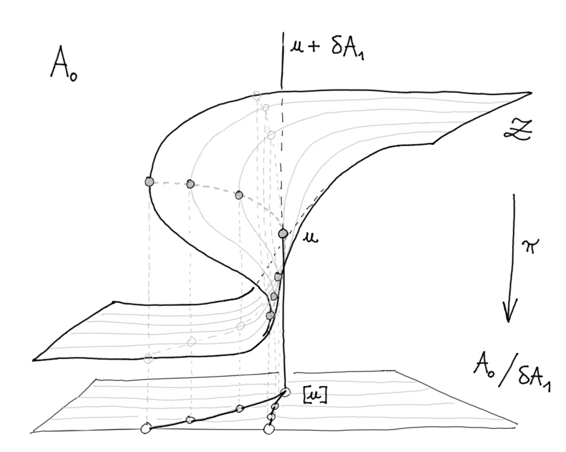

# Message-Passing Algorithms and Homology

In the vector space 
$$ A_0 $$ of interaction potentials, 
a smooth 
vector field $\delta \Phi : A_0 \to \delta A_1$
defines a message-passing scheme
whose associated diffusion equation:

$$
\frac {du} {dt} = 
\delta \Phi(u)
$$

is stationary on the submanifold ${\cal Z} \subseteq A_0$ 
of consistent interaction potentials, such that
every $u \in {\cal Z}$ defines consistent 
local probabilites $p \in \Gamma \subseteq \Delta_0$ 
by the Gibbs state formulas: 

$$ 
p_{ij} = \frac { {\rm e}^{-U_{ij}} } {Z_{ij}}
= \frac { {\rm e}^{- u_{ij} - u_{i} - u_{j}} }  {Z_{ij}}
$$
