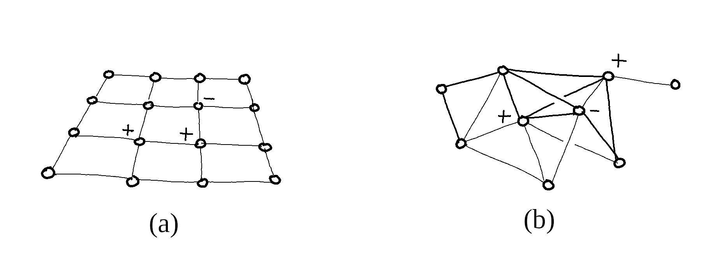

# Statistical Systems

Consider a large collection $\Omega = \{i, j, k, \dots \}$
of individual variables, each of them
denoted by $x_i \in E_i$ and assumed
to take values in a finite configuration space $E_i$.

In physics, one would for instance describe by
the cubic lattice $\Omega = {\mathbb Z}^3$ the atoms of a regular crystal,
each of which carrying a spin $x_i$ in $$E_i = \{ \pm 1 \}$$
in the Ising model of ferromagnetism.
Spin glasses drop the symmetry assumption:
$\Omega$ then describes the atoms of an amorphous solid,
where pairwise magnetic couplings are randomly distributed.

In communications, a sequence $$x_i \in \{ 0, 1 \}$$
describes a binary encoded message transmitted
over a noisy communication channel.
Decoding will consist in reconstructing the original message
from the altered version received.

In neural networks,
a binary variable $x_i$ would describe
two states "not firing" and "firing at maximal rate"
of an individual neuron,
as in the Hopfield model of associative memory.
Intermediate firing rates may be viewed as
convex combinations of such extremal rates,
i.e. probability densities on $E_i$.

When $\Omega$ grows large, applications face with the challenge of
describing interactions and collective phenomena effectively,
as the cost of global computations
is exponential in the number of variables.

## Sheaf of Microscopic States

A global configuration of the system
$x_\Omega = (x_i)_{i \in \Omega}$ gives the state
of everyone simultaneously, i.e. it is a point of the cartesian product:

$$ E_\Omega = \prod_{i \in \Omega} E_i $$

A local configuration of $\alpha \subseteq \Omega$
determines only the state
$x_\alpha = (x_i)_{i \in \alpha}$
of variables inside $\alpha$, and we write:

$$E_\alpha = \prod_{i \in \alpha} E_i$$

Given $\alpha \supseteq \beta$,
a local configuration $x_\alpha \in E_\alpha$
induces a unique configuration $x_\beta \in E_\beta$,
forgetting the states of variables outside $\beta$.
The canonical restrictions $E_\alpha \to E_\beta$
give $E_{\bullet}$ the structure of a discrete sheaf of sets
over $\Omega$:

Each $E_i$ is called the *fiber* above $i \in \Omega$,
and $x_\alpha \in E_\alpha$ is called a *local section*
of $E_\bullet$ over $\alpha \subseteq \Omega$.

## Total Energy and Homology

The total hamiltonian $H_\Omega : E_\Omega \to {\mathbb R}$
describes the energy
of the system in each configuration.
It is an element of the algebra of global observables:

$$
A_\Omega = {\mathbb R}^{E_\Omega}
\simeq \bigotimes_{i \in \Omega} {\mathbb R}^{E_i}
$$

The dimension of $A_\Omega$
is exponential in the cardinal of $\Omega$,
although in practice $H_\Omega$ is parametrised by a much
smaller subspace of $A_\Omega$ and may be written as a sum of
local interactions:

$$ \begin{equation} \label{H_Omega}
H_\Omega(x_\Omega) = \sum_{\alpha \in X } h_{\alpha}(x_\alpha)
\end{equation}$$

whenever the covering $X \subseteq {\mathcal P}(\Omega)$
is coarse enough to yield all the non-zero
interaction potentials.
The Ising model for instance assumes
only pairwise magnetic interactions between nearest neighbours,
its hamiltonian decomposing as:

$$
H_\Omega(x_\Omega) = - \sum_{i} B_i \, x_i
- \sum_{ij} C_{ij}\, x_i x_j
$$

so that $H_\Omega$ is parametrised by interaction potentials of the form:

+ $h_i(x_i) = \pm B_i$ depending on whether $x_i$ is aligned with
    the local magnetic field $B_i$,
+ $h_{ij}(x_i, x_j) = \pm C_{ij}$ depending on whether $x_i$ and $x_j$
    are aligned or not.

It is common for the covering $X$
to form a graph in $\Omega$, having
edges of cardinal 2 as maximal elements,
although nothing prevents $X$ from having higher dimensional cells
$\alpha \subseteq \Omega$, such as triangles, tetrahedrons, etc.

In general, a *factor graph* represents $X \subseteq {\mathcal P}(\Omega)$
by a bipartite graph with a variable node for each $i \in \Omega$,
a factor node for each $\alpha \in X$,
and an edge between $\alpha$ and $i$ whenever $i \in \alpha$,
as depicted below.

<!--
Variables nodes $i \in \Omega$
and factor nodes $\alpha \in X$
are eventually labeled
with a microstate $x_i \in E_i$
and a factor $f_\alpha : E_\alpha \to {\mathbb R}$
respectively,
so that the whole labeled graph
represents a computation of the product
$\prod_\alpha f_\alpha(x_\alpha)$, or equivalently
of the sum $\sum_\alpha h_\alpha(x_\alpha)$
if $f_\alpha = {\rm e}^{- h_\alpha} > 0$ for all $\alpha \in X$.
-->

### Fields and Potentials

<strong>Definition.</strong>
Given $X \subseteq {\mathcal P}(\Omega)$, we call
<em>potential</em> a collection of local observables
$(h_\alpha)_{\alpha \in X}$ where $h_\alpha \in {\mathbb R}^{E_\alpha}$
for all $\alpha \in X$, and denote by:

$$
A_0(X) = \bigoplus_{\alpha \in X} A_\alpha
\quad \mathrm{with} \quad
A_\alpha = {\mathbb R}^{E_\alpha}
$$

or simply by $A_0$ when unambiguous,
the space of potentials over $X$.

Letting $\int_X h = \sum_\alpha h_\alpha$ denote
the global hamiltonian $H_\Omega$ as defined by equation $(\ref{H_Omega})$,
potentials span a subspace of $A_\Omega$ through the *total energy map*:

$$
\begin{equation} \label{int_X}
\int_X :
\left\{  \begin{array}{lll}
A_0     &\longrightarrow & A_\Omega \\[0.2cm]
h &\longmapsto & \displaystyle \sum_\alpha h_\alpha
\end{array} \right.
\end{equation}
$$

The image $[A_0]$ of $\int_X$ is not isomorphic to $A_0$,
as the local subalgebras
$A_\alpha$ for $\alpha \in X$
are not in direct sum within $A_\Omega$.

<strong>Definition.</strong>
Given $X \subseteq {\mathcal P}(\Omega)$, we call
<em>current</em> a collection of local observables
$(\varphi_{\alpha \to \beta})$
where $\varphi_{\alpha \to \beta}\in {\mathbb R}^{E_\beta}$
is an observable on $\beta$ for all $\alpha \supset \beta$ in $X$,
and denote by:

$$
A_1(X) = \bigoplus_{\alpha \supset \beta}
A_{\alpha\to\beta}
\quad \mathrm{with} \quad
A_{\alpha\to \beta} = {\mathbb R}^{E_\beta}
$$

or simply by $A_1$ when unambiguous,
the space of currents over $X$.

Currents are to potentials what vector fields are to scalar fields,
a discrete analogy with differential geometry
that is naturally expressed with the language of homology.

We show that $[A_0]$ is naturally isomorphic
to the first homology $A_0 / \delta A_1$ of
 a *chain complex* of
observable fields $(A_\bullet, \delta)$
that naturally extends $A_0$, i.e:

+ a graded vector space
    $A_\bullet = A_0 \oplus A_1 \oplus \dots \oplus A_n$,
+ a boundary operator
    $\delta : A_{p + 1} \to A_p$ satisfying $\delta \circ \delta = 0$,

This means that $\delta A_1$ is precisely
the kernel of the total energy map
$\int_X : A_0 \longrightarrow A_\Omega$
defined by equation $(\ref{H_Omega})$,
its image being hence isomorphic to:

$$ [A_0] \simeq A_0 / \delta A_1 $$

 <strong>Definition.</strong>
We call <em>divergence</em> the linear map $\delta : A_1 \to A_0$ defined
for every $\varphi \in A_1$ by:

$$
(\delta \varphi)_\beta (x_\beta) =
\sum_{\alpha' \supset \beta} \varphi_{\alpha' \to \beta}(x_\beta)
- \sum_{\beta \supset \gamma'} \varphi_{\beta \to \gamma'}(x_{\gamma'})
$$

Two potentials $u$ and $h$ are called _homologous_ if and only if
they only differ by a divergence.
Denoting by $[h] = h + \delta A_1$ the homology class of $h \in A_0$:

$$
[ h ]  =  [ u ] \quad \Leftrightarrow \quad
\exists \varphi \in A_1 \quad u = h + \delta \varphi
$$

The fundamental theorem ([2.13](/assets/bib/phd.pdf#page=37)) shows
that $[h] = [u]$ if and only if $\int_X h = \int_X u$,
i.e. $[A_0] = A_0 / \delta A_1$
and global hamiltonians are homology classes of local potentials.
